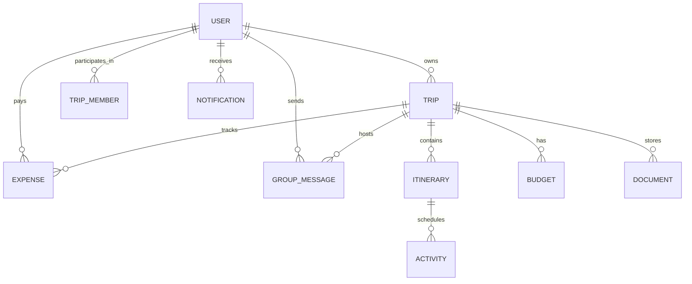

# 🌍 TripNest — Travel Planning & Trip Management Platform

> **TripNest** is a full-stack, enterprise-grade travel planning and collaborative trip management application built with **Spring Boot 3 (Java 17+)**, **React (Vite + Tailwind CSS)**, **Spring Security (JWT + OAuth2)**, **Hibernate / JPA**, and **Chart.js**.

---

## 🌟 Key Features

### 👤 1. Authentication, Authorization & User Profiles
- **JWT Authentication & Stateless Security**: Secure Bearer tokens with 24-hour expiration.
- **Role-Based Access Control (RBAC)**: Supports `ROLE_TRAVELER`, `ROLE_GROUP_ADMIN`, and `ROLE_ADMIN`.
- **OAuth2 Google Login**: Quick sign-in with Google integration and profile image synchronization.
- **Password Recovery**: Tokenized password reset workflow and in-app password changes.
- **Customizable Profiles**: Avatars, travel preferences, phone, and traveler bios.

### 🗺️ 2. Destination Catalog, Weather & Interactive Maps
- **Curated Worldwide Destinations**: Paris, Tokyo, Rome, Bali, Swiss Alps, New York, Santorini, Machu Picchu.
- **Category & Keyword Filtering**: Search by Beach, Mountain, Cultural, City, Adventure, or Historical.
- **Live & Fallback Weather Widget**: Real-time OpenWeather integration with graceful mock fallbacks and 5-day forecasts.
- **Interactive OpenStreetMap Embed**: Pinpoint coordinates and explore local attraction spots.

### 📅 3. Trip & Day-Wise Itinerary Planning
- **Smart Itinerary Generation**: Automatic creation of day-by-day itinerary placeholders on trip creation.
- **Activity Scheduler**: Schedule Sightseeing, Transportation, Hotels, Dining, and Adventures with start times, duration, addresses, and estimated costs.
- **Public Trip Sharing**: Unique share codes (`/trips/share/{shareCode}`) for instant itinerary viewing without sign-in.
- **Status Lifecycle**: Manage `PLANNED`, `ONGOING`, `COMPLETED`, and `CANCELLED` trips.

### 💰 4. Budget Tracking, Expense Management & Equal Splits
- **Live Financial Progress Bar**: Real-time budget utilization indicator with overspending warnings.
- **Category Allocation**: Automatic expense aggregation for Food, Transportation, Accommodation, Shopping, Entertainment, and Misc.
- **Group Expense Settlement Matrix**: Smart algorithm calculating equal shares and net reimbursement transfers (*"Alice pays Bob $35.00"*).

### 👥 5. Group Collaboration, Document Vault & Discussions
- **Trip Companion Invitations**: Invite companions via email with `GROUP_ADMIN` or `MEMBER` permissions.
- **Document & Booking Vault**: Upload and manage flight tickets, hotel confirmation PDFs, visa copies, and travel photos.
- **Real-Time Group Stream**: In-trip message stream for group discussions and notes.
- **In-App Notification Center**: Automated reminders for upcoming activities, budget alerts, and invitation alerts.

### 📊 6. Analytics, Reporting & Admin Dashboard
- **Chart.js Visualizations**: Category spending Doughnut chart, monthly spending Line chart, and trip status Bar charts.
- **CSV Data Export**: Download expense breakdowns with one click.
- **Admin Control Center**: Platform KPIs, user role switching, account toggling, and global trip moderation.

---

## 🏗️ Technical Architecture & Database Design



---

## 🔑 Pre-Seeded Demo Credentials

The application automatically seeds initial data on first startup:

| Account Role | Email Address | Password | Permissions |
| :--- | :--- | :--- | :--- |
| **Platform Admin** | `admin@tripnest.com` | `admin123` | Full access, user management, platform analytics, trip moderation |
| **Lead Traveler** | `traveler@tripnest.com` | `traveler123` | Pre-configured Paris trip with activities, budget, expenses & companions |
| **Group Admin** | `sarah@tripnest.com` | `sarah123` | Group collaboration & co-planning |

---

## 🚀 Quick Start (Local Development)

### 1. Prerequisites
- **Java 17+** (JDK 17, 21, or 26)
- **Maven 3.8+**
- **Node.js 18+ & npm**

### 2. Start Backend (Port 8080)
The backend uses an embedded H2 file database by default in MySQL compatibility mode (`./data/tripnestdb`), requiring zero setup.
```bash
cd backend
mvn spring-boot:run
```
- API Base URL: `http://localhost:8080/api`
- H2 Web Console: `http://localhost:8080/h2-console` (JDBC URL: `jdbc:h2:file:./data/tripnestdb`, User: `sa`, Password: *blank*)

### 3. Start Frontend (Port 5173)
```bash
cd frontend
npm install
npm run dev
```
Open **`http://localhost:5173`** in your browser.

---

## 🐳 Production Deployment with Docker Compose

To run the complete production stack (PostgreSQL + Spring Boot Backend + Nginx React Frontend):

```bash
docker-compose up --build -d
```
- Frontend UI: `http://localhost`
- Backend API: `http://localhost:8080/api`
- PostgreSQL DB: `localhost:5432`

---

## 🧪 Automated Testing

### Backend Unit & Integration Tests (JUnit 5 + Mockito + MockMvc)
```bash
cd backend
mvn test
```
*Executes all authentication, authorization, trip scheduling, and expense calculation test suites.*

### Frontend Production Build Validation
```bash
cd frontend
npm run build
```

---

## 📮 Postman Collection
Import `tripnest_api_collection.json` into Postman to test all endpoints.
